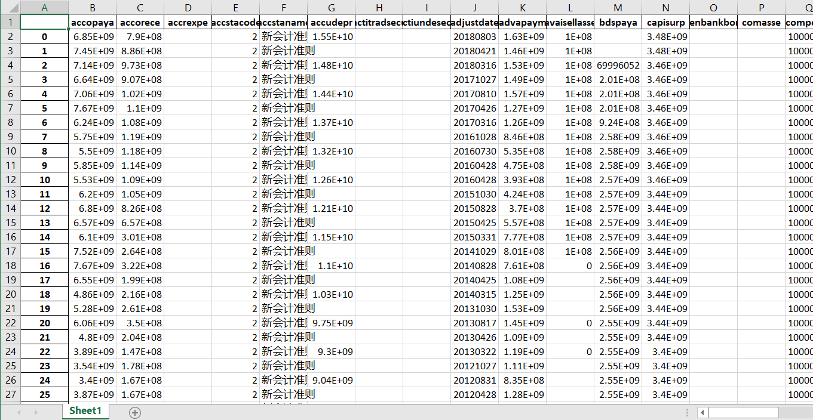
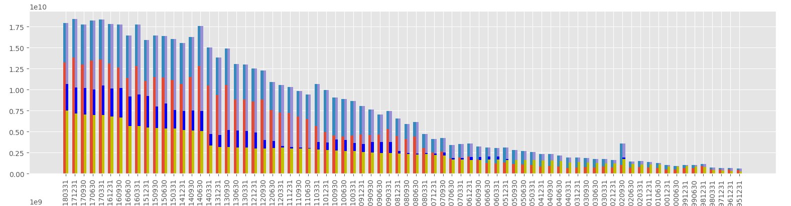
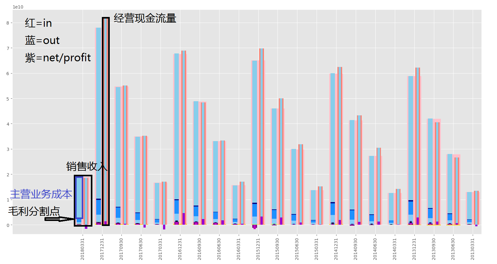

# 雪球爬虫
# 爬取
run xueqiuBalanceSheet.py  
如果雪球拒绝，请更改xueqiu.py的header(打开chrome访问雪球 F12)

# 可视化
## 资产负债表
run ana/bsAna.py

## 利润表和现金流量表
run ana/is_cfs_ana.py

- 先看利润，利润都不好看的基本面肯定不好
- 看现金流量表，利润好看，但是经营现金流净额经常负一下的估计也不好
- 看看销售收入是不是稳步增长
- 看看毛利率怎么样
# 未完待续。。。
## 横向比较
## 银行，金融
## bs-cfs， bs-es 
